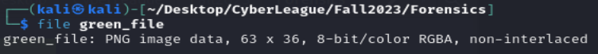

## Forensics

**Tools:**

1. Git command
2. Linux command
3. binwalk

**Concepts:**

1. Git
2. Extract files in a picture

**Question:** 

1. This file initially looks like something green, what's the file format of this green file?
    
    **Ans:** **PNG**
    
    
    
2. How many files can be extracted from the binary blob?
    
    **Ans: 6**
    
    
    
3. What is the hidden flag in the file?
    
    **Ans: SKY-RWCI-4291**
    
    
    
    